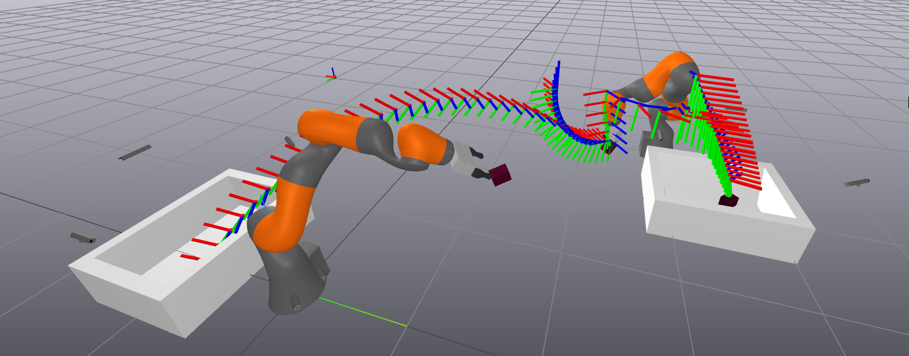

# Throwing-Robots
We construct a method for robots to successfully throw objects between one another. Throwing has the ability to expand a robot's reach and operation space, having many useful applications for solving tasks that would otherwise be complex or impossible to execute without throwing. Many robust methods exist for manipulation throwing problems which leverage techniques such as reinforcement learning. We deviate from methods for throwing that have been proven to be effective in an attempt to explore the feasibility of a physics based method not widely researched. To this end, we designed a robotic manipulator capable of throwing using inverse dynamics control. The system detailed in this paper features two robots that can either be an idle bot or a throwing bot at any time. We designate idle bots to be robots that detect and grasp objects that enter its operation space, and throwing bots to be robots that throw grasped objects to a target position. We achieve this through the use of inverse dynamics control, geometric-based antipodal grasping, trajectory planning, and high-level task planning. The result is a closed system of robots that can accurately throw to target positions using purely inverse dynamic control. We show that this is feasible in simple environments, and also investigate the factors that contribute to inaccuracies and the motivation for learning based methods. 

Demo Link: https://www.youtube.com/watch?v=HvuFJTrRoTU
